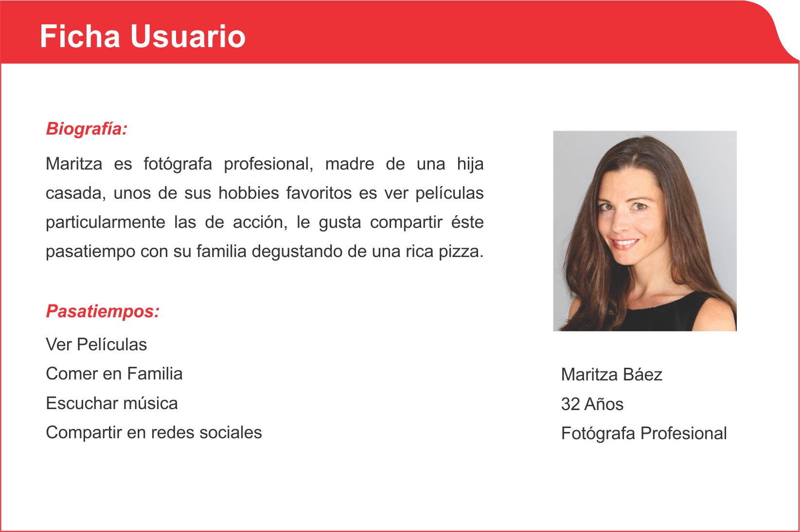
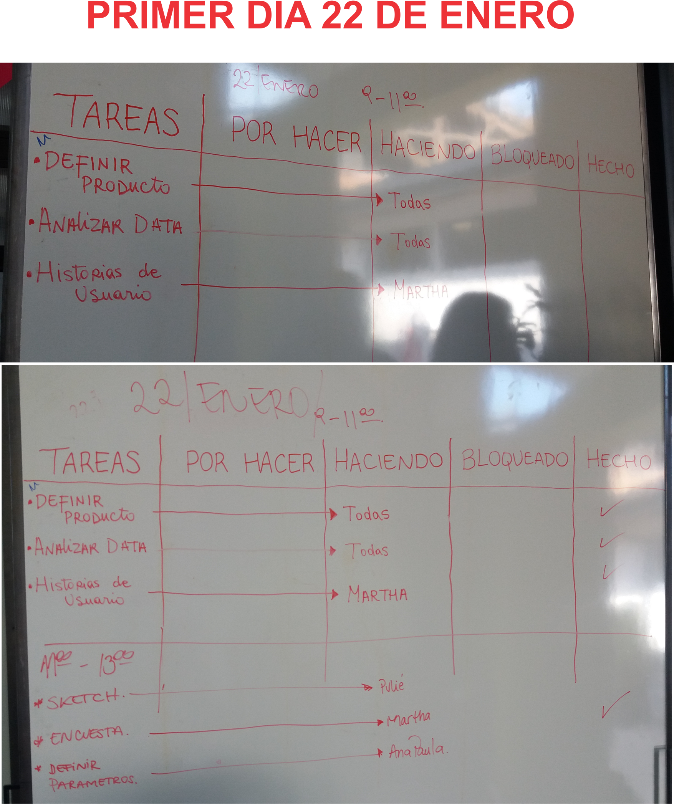
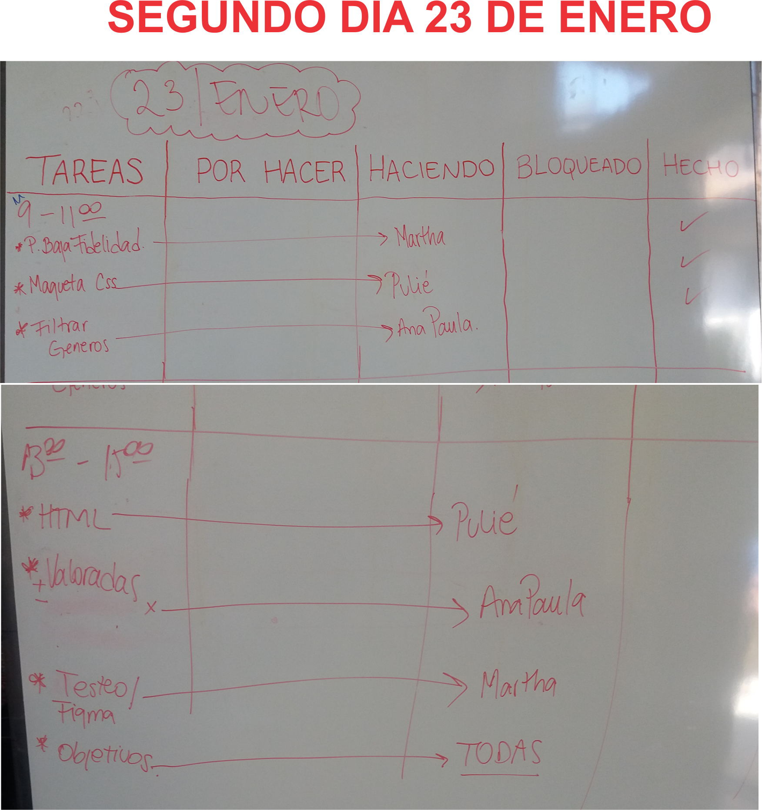
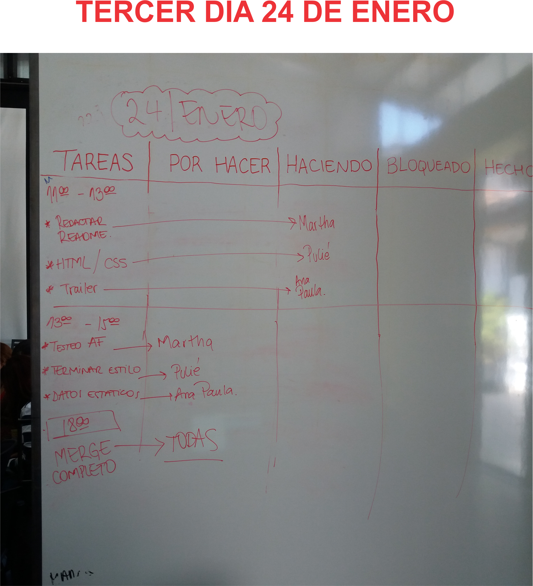

# PopCorn Night
Definición del Producto
PopCorn Night es una aplicación Web que nace al querer satisfacer a un público muy particular, en éste caso personas que tiene un gusto especial por el séptimo arte "cine", que puede serlo por afición o por pasatiempo. Va dirigido a usuarios que gusta del análisis y crítica de los filmes. En este website les permitirá buscar de manera ordenada los films por categoría, ver una pequeña reseña, trailer, actores y guardar sus films favoritos en su repositorio. Igualmente tendrá la opción de pedir comida de manera fácil y rápida. También tendrá la oportunidad de pertenecer a una comunidad "cine club" donde podrá opinar, evaluar, hacer críticas de un film en particular.
 ## Investigación
 Durante la fase de investigación, se realizó una encuesta a 25 personas para obtener información, recopilar datos relevantes que querían que mostráramos en el website. Encuesta que concluyó en:

RESULTADOS DE LA ENCUESTA
El 96% dijo que Sí le gusta ver películas .
Datos relevantes que les gustaría que se mostrara en el website:
Género 84%
Actores 78,9%
Trailers 63,2%
Resumen 42,1%
Premios / Reconocimientos 26,3%
Año de Lanzamiento 21,1%
Director 5,3%
Géneros que más gusta:
Acción
Comedia
Drama
Hora en que más prefieren ver una película: Noche
Suelen consumir algún snack: Palomitas 68%
Luego de ver una película les gustaría darle una puntuación: Si 68%
Antes de ver una película les interesa saber de qué trata, ver un pequeño resumen: Si 96%
Les gustaría saber opiniones de otros fanáticos acerca de una película en particular? Si 88%
[Puedes visualizar en el link las respuestas de nuestra encuesta](https://docs.google.com/spreadsheets/d/1XfTZUzbPZvUQH62HOShgO938TXVzetrRw_Q2Jj0li6o/edit#gid=1925664627)
## Gráficas de los resultados de la encuesta

 ## Definición del usuario
PopCorn Night está enfocado a un público  fanático del cine ya sea por afición, pasatiempo o hobby que ve al "cine" como un arte, donde además de disfrutar de la información de la  película, puede guardarla en su repositorio para disfrutarla en el momento que él desee junto con ésto le ofrecemos un servicio de comida rápida online sugiriendo nuestro menú especial.
Nuestro fanático podrá compartir información del film y exponer su crítica, opinando en la comunidad  "cine club" y darle una puntuación. 

 ## Historias de usuarios
1.- Cómo usuario fanático de los films quiero buscar las películas por categoría para encontrarlas de manera más rápida y precisa.
 
2.- Como usuario fanático de los films quiero leer un resumen de la trama de la película para saber de qué trata y si me resulta atractiva o no. 
 
3.- Como usuario fanático de los films quiero que me llegue a la casa una pizza a la hora de ver la película para compartir un momento agradable con mi familia.
 
4.- Como usuario crítico de los films quiero dar mi valoración/puntuación de la película para que otros usuarios puedan tener una idea cuánto ha gustado o no la película.

## Criterios de Aceptación
Historia 1: 
*Al ingresar a la página Principal el usuario hará click en el menú a la opción "categorías".
*Se desplegará una lista con las diferentes categorías de películas a escoger.
*Al seleccionar una categoría, aparecerán todas las imágenes de los poster de dicho género.
Historia 2: 
*Al ingresar a la página Principal el usuario hará click en cualquiera de los posters.
*Se mostrará una pantalla con la información de la película.
*El usuario podrá hacer click en el botón de los trailers y se mostrará un mini video de la película
Historia 3: 
*El usuario tendrá la opción en cualquiera de las pantallas de acceder a un botón flotante para pedir comida rápida.
*Al hacer click en el botón pasará a otra pantalla donde aparecerá un menú especial de comida.
*Podrá escoger su comida y pedirla dandole click al botón "pedir ya".
Historia 4: 
*Al ingresar a la página Principal el usuario hará click en el menú a la opción "club cine".
*Se pasará a una pantalla donde se registrará el usuario para pertenecer a la comunidad.
*Al estar registrado entrará a la comunidad "club cine" donde podrá ver un promedio general de puntuación de una película en particular, ver las diferentes opiniones de otros usuarios.
*El usuario podrá hacer click al botón "votar" y podrá escribir su opinión.

## DISEÑO
### Testeo de Baja Fidelidad
Con el usuario definido y su necesidad llevamos a cabo el test de baja fidelidad usamos la herramienta Sketching, ya que es la forma más fácil de visualizar las ideas. Se dibujó a mano alzada para transmitir las ideas de forma rápida y sencilla.

En un comienzo se para el prototipo de baja diseñamos cinco pantallas.
La primera pantalla la principal consta de un carrusel con los poster de las películas a estrenar, en la parte superior derecha cuenta con un navbar con la posibilidad de hacer busqueda por titulo de film y dos botones uno para ingresar y otro para registrarse. El parte superior izquierda cuenta con un menú, (inicio, categoria, club ). Debajo del carrusel de mostrará los poster de las películas mejor valoradas y un botón flotante para pedir comida online.
En la segunda pantalla se muestra las características de una película en particular, con la información que el usuario desea saber.
En la tercera pantalla muestra los resultados de una categoría de películas  donde al hacer click a cualquiera de ellas se irá a la pantalla dos para mostrar la información de la misma.
En la cuarta pantalla se muestra el formulario donde el usuario tendrá que llenar con sus datos si quiere pertenecer al club.}
En la quinta pantalla se muestra la página principal del "club cine" con las diferentes valoraciones y opiniones de otros usuarios.
Luego de analizar el prototipo de baja fidelidad se hicieron las mejoras pertinentes al diseño. Dichas mejoras se obtuvieron al testearlo con 2 usuarios aleatorios y al  buen feedback con el cliente y los interesados del website.
Ya con las correcciones al prototipo de baja se procedió a Diseñar el prototipo de alta. 
## Prototipo de Alta Fidelidad
Para diseñar el prototipo de alta se utilizó la herramienta FIGMA, siguiendo las mejoras anteriores y guiándonos con los resultados de la encuesta.

[Aquí podrás ver nuestro prototipo de alta:](https://www.figma.com/file/G7QWyK6b910KBhntJkv3YuEK/Hackaton?node-id=0%3A1)
## Test de Usabilidad
Se evaluó el producto con 2 usuarios aleatorios.
Siguieron 3 tareas dadas por nosotros, observamos y tomamos notas. Logrando identificar ciertos problemas de usabilidad.
Próximamente de acuerdo a dichos problemas se ajustaran las correcciones necesarias para mejorar la website.
## Planificación
Fuimos grupo de 3 participantes:
Paulina Vera Pavez: (FE, trabajó en la maquetación y CSS)
Ana Paula Monsalve: (FE, trabajó en javascript parte funcional de la pagina)
Martha Lizarazo: (UX, Investigación, Radme, prototipo testeado, )
Sprim de 3 días
Asignamos tareas únicas a cada uno, las tareas fueron dadas por horas diariamente.
Herramienta usada:  Pizarra.

